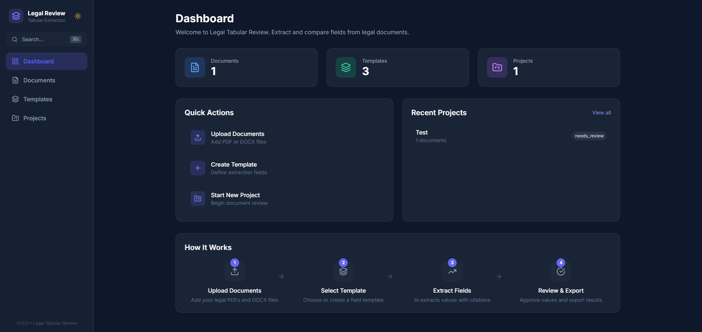
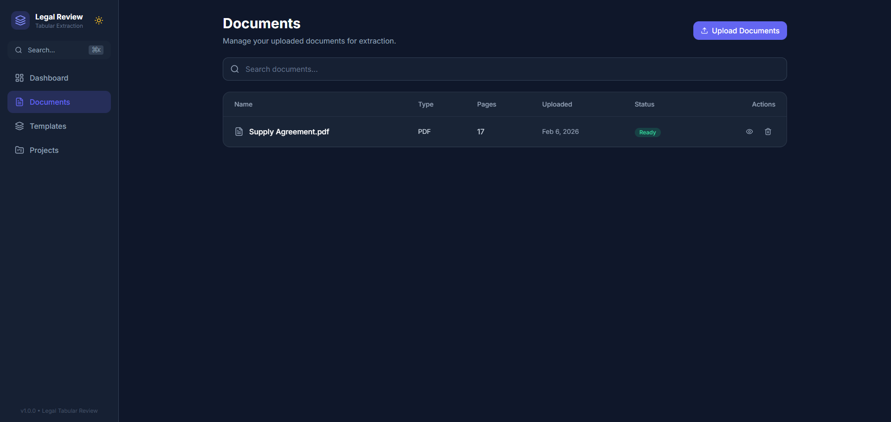
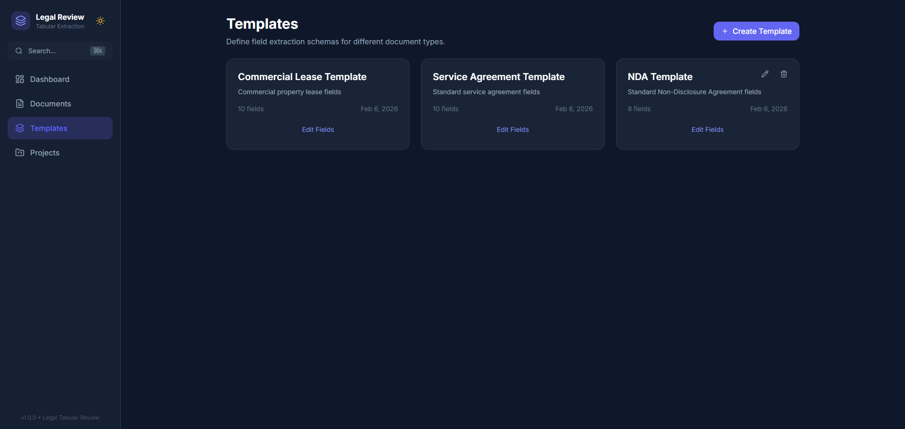
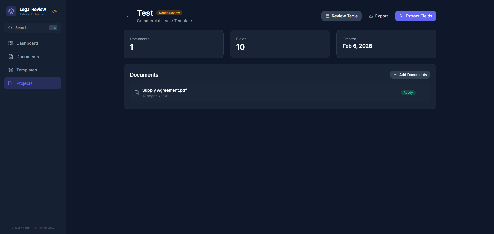
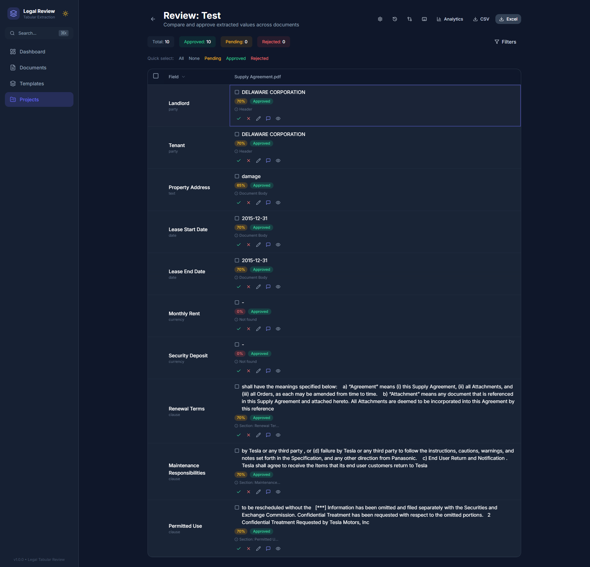
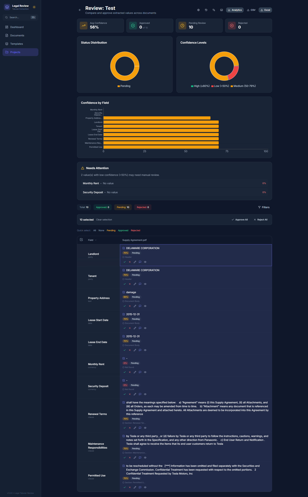

# Legal Tabular Review

A tool for extracting structured data from legal documents and reviewing it in a side-by-side table. If you've ever had to manually pull dates, party names, and dollar amounts out of dozens of contracts — this is the app that does it for you.

Upload your PDFs, define what fields you care about, run extraction (AI-powered or regex-based), and then review everything in one place with confidence scores and source citations.

---

## Table of Contents

- [Why This Exists](#why-this-exists)
- [Features](#features)
- [Screenshots](#screenshots)
- [Getting Started](#getting-started)
- [Configuration](#configuration)
- [Project Structure](#project-structure)
- [How It Works](#how-it-works)
- [API Reference](#api-reference)
- [Keyboard Shortcuts](#keyboard-shortcuts)
- [Testing](#testing)
- [CI/CD](#cicd)
- [Tech Stack](#tech-stack)
- [License](#license)

---

## Why This Exists

Legal teams often deal with stacks of contracts that need to be compared against each other — lease agreements, NDAs, service contracts, etc. The typical workflow involves opening each document, hunting for the same 10-15 fields, and manually copying values into a spreadsheet.

This tool automates the extraction part and gives you a proper review interface instead of a messy spreadsheet. You still get the final say on every value (approve, reject, or edit), but the tedious part is handled for you.

---

## Features

### Document Management
Upload PDFs, DOCX files, or plain text. The app parses them and stores the content for extraction. There's a 50MB file size limit per document, and you can upload multiple files at once.

### Template-Based Extraction
You define templates with the fields you want to extract — things like "Effective Date", "Landlord Name", "Monthly Rent", "Termination Clause", etc. Each field has a type (date, currency, party, clause, text, number) and optional validation/normalization rules.

Templates can be exported as JSON and imported into other projects, so you don't have to rebuild them every time.

### AI + Fallback Extraction
If you provide an OpenAI API key, the app uses GPT-4o to extract values with high accuracy. Without a key, it falls back to regex pattern matching — less accurate, but still useful for well-structured documents. Either way, you get confidence scores and source citations for every extracted value.

### Review Table
This is the core of the app. Once extraction runs, you get a matrix view with fields as rows and documents as columns. Each cell shows the extracted value, its confidence score, status badge, and citation.

You can:
- **Approve/Reject/Edit** individual values
- **Bulk select** and approve or reject multiple values at once
- **Filter** by status (pending, approved, rejected, edited) or confidence level (high/medium/low)
- **Sort** by field name or confidence
- **Navigate** with keyboard shortcuts

### Comments
Leave comments on any extracted value. Useful when you want to flag something for a colleague or note why you edited a value.

### Audit Log
Every action is tracked — who approved what, when values were edited, what the old value was. The audit trail is available per-project and per-value.

### Analytics
A built-in analytics panel shows extraction statistics: confidence distributions, status breakdowns, per-field accuracy. Powered by Recharts.

### Validation
Define validation rules on template fields (regex patterns, min/max values, date ranges, length constraints). After extraction, run validation to flag any values that don't meet the rules.

### Search
Global search across all extracted values. Filter by project, field type, status, or confidence range. Includes autocomplete suggestions.

### Value Comparison
A diff view for comparing extracted values across documents side by side. Handy when you need to spot inconsistencies between contracts.

### Export
Export your reviewed data as CSV or Excel. The export includes values, citations, and confidence scores in a matrix format (fields × documents).

### Project Settings
Per-project configuration for auto-approve (automatically approve values above a confidence threshold) and notification preferences.

### Document Preview
View the source document with citation highlighting — click on a citation and see exactly where in the document the value was extracted from.

---

## Screenshots

The app ships with a dark UI built on Tailwind. Here's what the main screens look like:

### Dashboard

The landing page with stats, quick actions, and recent projects.



### Documents

Upload and manage your legal documents (PDF, DOCX, TXT).



### Templates

Define extraction templates with custom fields for different document types.



### Projects

Organize your review work into projects, each with a template and set of documents.


### Project View

See project details, attached documents, and trigger extraction.



### Review Table

The core interface — compare extracted values across documents in a matrix view. Approve, reject, or edit values with confidence scores and citations.



### Analytics

View extraction statistics — confidence distributions, status breakdowns, and per-field accuracy metrics.



---

## Getting Started

### Docker (recommended)

The fastest way to get everything running:

```bash
docker-compose up -d
```

Once the containers are healthy:
- **App:** http://localhost:3000
- **API docs (Swagger):** http://localhost:8000/docs
- **API docs (ReDoc):** http://localhost:8000/redoc

Data is persisted across restarts using Docker volumes (uploads, exports, and the SQLite database).

### Local Development

If you prefer running things directly:

**Backend:**

```bash
cd backend
python -m venv venv

# Linux/Mac
source venv/bin/activate

# Windows
venv\Scripts\activate

pip install -r requirements.txt

# Run database migrations
alembic upgrade head

# Start the server
uvicorn app.main:app --reload --port 8000
```

**Frontend:**

```bash
cd frontend
pnpm install
pnpm dev
```

The frontend dev server runs on http://localhost:5173 and proxies API requests to the backend at port 8000.

---

## Configuration

All configuration is done through environment variables. You can set them in a `.env` file in the project root, or pass them directly via Docker.

| Variable | What it does | Default |
|---|---|---|
| `DATABASE_URL` | Database connection string. SQLite works out of the box. | `sqlite:///./legal_review.db` |
| `OPENAI_API_KEY` | Enables AI-powered extraction. Leave blank to use pattern matching. | _(empty)_ |
| `OPENAI_MODEL` | Which OpenAI model to use for extraction. | `gpt-4o` |
| `UPLOAD_DIR` | Where uploaded documents are stored on disk. | `./uploads` |
| `EXPORT_DIR` | Where generated exports (CSV/Excel) are written. | `./exports` |
| `MAX_FILE_SIZE_MB` | Maximum upload size per file. | `50` |
| `ALLOWED_EXTENSIONS` | Accepted file types for upload. | `pdf, docx, txt` |
| `DEBUG` | Enables debug logging. | `false` |
| `CORS_ORIGINS` | Allowed CORS origins (comma-separated). | `http://localhost:3000, http://localhost:5173` |

---

## Architecture

```text
┌─────────────────────────────────────────────────────────────────┐
│                    FRONTEND (React + Vite)                      │
│                                                                 │
│   Dashboard    Templates    Projects    Review Table            │
│                                                                 │
│                     Axios API Client                            │
└───────────────────────────┬─────────────────────────────────────┘
                            │
                        HTTP/REST
                            │
┌───────────────────────────▼─────────────────────────────────────┐
│                      BACKEND (FastAPI)                          │
│                                                                 │
│  Routes: /documents /templates /projects /search /audit /export │
│                                                                 │
│  Services: Document, Template, Extraction, Validation, Export   │
│                                                                 │
│  Data Layer: SQLAlchemy ORM                                     │
└───────────────────────────┬─────────────────────────────────────┘
                            │
          ┌─────────────────┼─────────────────┐
          ▼                 ▼                 ▼
    ┌──────────┐     ┌───────────┐     ┌───────────┐
    │  SQLite  │     │  /uploads │     │  OpenAI   │
    │ Database │     │   (docs)  │     │ (optional)│
    └──────────┘     └───────────┘     └───────────┘
```

**Data Flow:**
1. Upload documents → parsed and stored in `/uploads`
2. Create template → define fields to extract (dates, parties, amounts, etc.)
3. Create project → link template + documents
4. Run extraction → AI (GPT-4o) or regex patterns pull values with confidence scores
5. Review → approve/reject/edit values in the comparison table
6. Export → download as CSV or Excel

For more details, see [docs/ARCHITECTURE.md](docs/ARCHITECTURE.md).

---

## Project Structure

```
legal-tabular-review/
├── backend/
│   ├── alembic/                 # Database migrations
│   │   └── versions/
│   ├── app/
│   │   ├── models/              # SQLAlchemy models
│   │   ├── repositories/        # Data access layer
│   │   ├── routes/              # API endpoints
│   │   ├── schemas/             # Pydantic request/response models
│   │   ├── services/            # Business logic
│   │   │   └── strategies/      # Extraction strategies (AI, pattern)
│   │   ├── config.py            # App configuration
│   │   ├── database.py          # DB connection setup
│   │   ├── exceptions.py        # Custom error classes
│   │   └── main.py              # FastAPI app entry point
│   ├── tests/
│   ├── Dockerfile
│   └── requirements.txt
├── frontend/
│   ├── src/
│   │   ├── api/                 # Axios API client
│   │   ├── components/          # Reusable UI components
│   │   ├── contexts/            # React contexts (theme)
│   │   ├── hooks/               # Custom hooks
│   │   ├── pages/               # Route-level page components
│   │   ├── constants/
│   │   └── utils/               # Formatting helpers
│   ├── nginx.conf               # Production nginx config
│   ├── Dockerfile
│   └── package.json
├── data/                        # Sample documents for testing
├── docs/                        # Design documents
├── docker-compose.yml
└── README.md
```

---

## How It Works

The general workflow looks like this:

1. **Upload documents** — PDFs, DOCX, or TXT files get parsed and their text content is stored in the database.

2. **Create a template** — Define the fields you want to extract. For example, a lease template might have fields like "Landlord", "Tenant", "Monthly Rent", "Lease Start Date", "Lease End Date", "Security Deposit". Each field has a type and optional validation rules.

3. **Create a project** — A project ties a template to a set of documents. Think of it as "I want to extract these fields from these documents."

4. **Run extraction** — The app processes each document against the template. If an OpenAI key is configured, it sends the document content to GPT-4o with a structured prompt. Otherwise, it uses regex patterns tuned to the field type. Either way, you get extracted values with confidence scores and citations.

5. **Review** — Open the review table. Each cell in the matrix is an extracted value. Review them one by one or use bulk actions. Approve, reject, or edit as needed. Add comments if you want to leave notes.

6. **Export** — Once you're happy with the results, export to CSV or Excel.

### Auto-Approve

If you want to speed things up, enable auto-approve in project settings. Values above a certain confidence threshold (default 90%) get automatically approved during extraction. You can always override these later.

---

## API Reference

The full interactive API docs are available at `/docs` (Swagger) or `/redoc` when the backend is running. Here's a quick overview of the main endpoints:

### Documents
| Method | Endpoint | Description |
|---|---|---|
| `GET` | `/api/documents` | List all documents |
| `GET` | `/api/documents/:id` | Get document details |
| `GET` | `/api/documents/:id/content` | Get document text content |
| `POST` | `/api/documents/upload` | Upload files (multipart) |
| `DELETE` | `/api/documents/:id` | Delete a document |

### Templates
| Method | Endpoint | Description |
|---|---|---|
| `GET` | `/api/templates` | List templates |
| `POST` | `/api/templates` | Create template |
| `PUT` | `/api/templates/:id` | Update template |
| `DELETE` | `/api/templates/:id` | Delete template |
| `POST` | `/api/templates/:id/fields` | Add field |
| `PUT` | `/api/templates/:id/fields/:fieldId` | Update field |
| `DELETE` | `/api/templates/:id/fields/:fieldId` | Delete field |
| `POST` | `/api/templates/:id/fields/reorder` | Reorder fields |
| `GET` | `/api/templates/:id/export` | Export as JSON |
| `POST` | `/api/templates/import` | Import from JSON |

### Projects
| Method | Endpoint | Description |
|---|---|---|
| `GET` | `/api/projects` | List projects |
| `POST` | `/api/projects` | Create project |
| `GET` | `/api/projects/:id` | Get project details |
| `PUT` | `/api/projects/:id` | Update project |
| `DELETE` | `/api/projects/:id` | Delete project |
| `POST` | `/api/projects/:id/documents` | Add documents |
| `DELETE` | `/api/projects/:id/documents/:docId` | Remove document |
| `POST` | `/api/projects/:id/extract` | Run extraction |
| `POST` | `/api/projects/:id/re-extract` | Re-run extraction |
| `GET` | `/api/projects/:id/values` | Get extracted values |

### Values
| Method | Endpoint | Description |
|---|---|---|
| `PUT` | `/api/projects/values/:id` | Update a value |
| `POST` | `/api/projects/values/:id/approve` | Approve a value |
| `POST` | `/api/projects/values/:id/reject` | Reject a value |
| `POST` | `/api/projects/values/bulk/approve` | Bulk approve |
| `POST` | `/api/projects/values/bulk/reject` | Bulk reject |

### Export
| Method | Endpoint | Description |
|---|---|---|
| `GET` | `/api/projects/:id/export/csv` | Download as CSV |
| `GET` | `/api/projects/:id/export/excel` | Download as Excel |

### Comments
| Method | Endpoint | Description |
|---|---|---|
| `GET` | `/api/comments/values/:valueId` | Get comments for a value |
| `POST` | `/api/comments/values/:valueId` | Add comment |
| `PUT` | `/api/comments/:id` | Edit comment |
| `DELETE` | `/api/comments/:id` | Delete comment |

### Audit, Search, Validation, Settings
| Method | Endpoint | Description |
|---|---|---|
| `GET` | `/api/audit/projects/:id` | Project audit log |
| `GET` | `/api/audit/values/:id` | Value audit log |
| `GET` | `/api/audit/recent` | Recent activity |
| `GET` | `/api/search?q=...` | Global search |
| `GET` | `/api/search/suggestions?q=...` | Search autocomplete |
| `POST` | `/api/validation/projects/:id/validate` | Run validation |
| `GET` | `/api/validation/projects/:id/summary` | Validation summary |
| `GET` | `/api/settings/projects/:id` | Get project settings |
| `PUT` | `/api/settings/projects/:id` | Update project settings |
| `POST` | `/api/evaluation/projects/:id/evaluate` | Run evaluation |

---

## Keyboard Shortcuts

The review table supports keyboard navigation. Press `?` at any time to see the shortcuts panel.

| Key | Action |
|---|---|
| `Arrow keys` | Navigate between cells |
| `A` | Approve the focused value |
| `R` | Reject the focused value |
| `E` | Edit the focused value |
| `Space` | Toggle selection on the focused value |
| `Esc` | Clear all selections |
| `?` | Show keyboard shortcuts help |

---

## Testing

### Running Backend Tests

```bash
cd backend
pip install -r requirements.txt
pytest --cov=app tests/
```

### Integration Tests

The integration test runner starts the app via Docker and hits the API:

```bash
cd backend
python tests/run_integration_tests.py
```

### What's Tested

- Document upload and parsing
- Template CRUD and field management
- Project creation, document association, extraction
- Search functionality
- Validation rules
- CSV and Excel export

---

## CI/CD

The project uses GitHub Actions with the following pipeline (`.github/workflows/ci.yml`):

1. **Backend Tests** — Runs pytest with coverage, reports to Codecov
2. **Backend Lint** — Runs Ruff for code style checks
3. **Frontend Build** — Builds the React app with pnpm, uploads artifacts
4. **Docker Build** — Builds both Docker images with layer caching
5. **Integration Tests** — Spins up docker-compose, runs health checks and basic API tests (on push to main only)

Triggered on pushes and PRs to `main`/`master`.

---

## Tech Stack

| Layer | Technology |
|---|---|
| Frontend | React 18, Vite, Tailwind CSS, Recharts, Axios, React Router |
| Backend | Python 3.11, FastAPI, SQLAlchemy, Pydantic, Alembic |
| Database | SQLite (default), PostgreSQL-compatible |
| AI | OpenAI GPT-4o (optional) |
| Infrastructure | Docker, Nginx, GitHub Actions |
| Testing | pytest, Ruff |

---

## License

MIT
